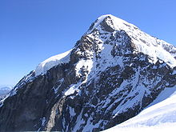

# Naglowek

Paragraf 1

Paragraf 2

Paragraf 3

**Pogrubienie**

*Kursywa*

~~Przekreslenie~~
>Cytat

1. Pierwszy
2. Drugi
3. Trzeci

* Pierwszy
* Drugi
* Trzeci

``print('Hello World)``

``if 5 > 2:``

``  print('5 wieksze od 2)``

LALALALAALA `print('Lalalala')` LALALALALALA

